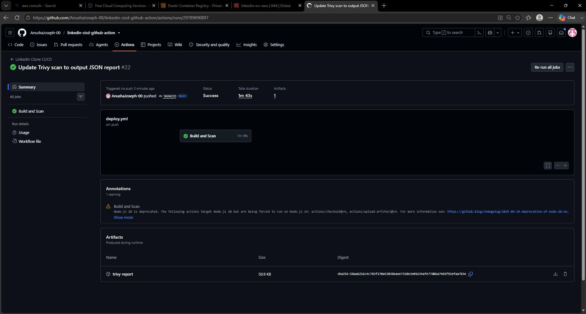
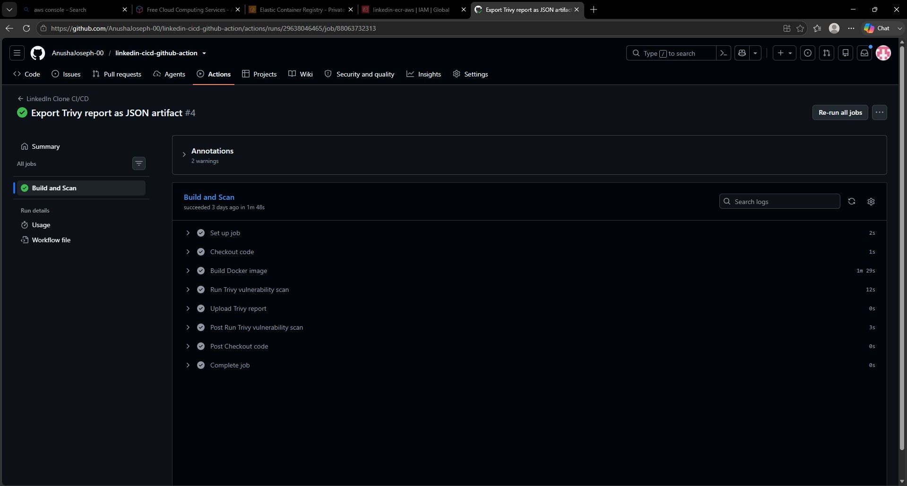

# LinkedIn Clone - CI/CD Pipeline with GitHub Actions & Trivy

A CI/CD pipeline built around a LinkedIn MERN clone, demonstrating automated Docker image builds and security vulnerability scanning using GitHub Actions and Trivy.

---

## Pipeline Overview

Push to main → Checkout Code → Build Docker Image → Trivy Security Scan → Upload Scan Report



---

## Tech Stack

Application: React.js + Node.js (Express) + MongoDB
Containerisation: Docker (Multi-stage build)
CI/CD: GitHub Actions
Security Scanning: Trivy
Image Registry: Amazon ECR (updating soon)

---

## Project Structure

```
linkedin-cicd-github-action/
├── .github/
│   └── workflows/
│       └── deploy.yml
├── frontend/                 # React.js application
├── backend/                  # Node.js Express API
├── Dockerfile                # Multi-stage Docker build
├── .gitignore
└── README.md
```

---

## Dockerfile

Two-stage build. Stage 1 builds the React app. Stage 2 runs the Express backend and serves the React build. Node 16 used for compatibility with older React scripts.

---

## GitHub Actions Workflow

Triggers on push to main. Runs four steps:

1. Checkout - pulls code from GitHub into the runner
2. Build - builds a Docker image tagged with github.run_number
3. Trivy scan - scans for HIGH and CRITICAL vulnerabilities, exports JSON report
4. Upload artifact - saves the JSON report as a downloadable artifact in the Actions tab

---

## Trivy Security Scanning

Scans OS packages and Node.js libraries for HIGH and CRITICAL vulnerabilities. Only flags issues that have a fix available. Report exported as JSON and downloadable from the Actions run summary.

---

## Updating soon

- Push to Amazon ECR
- Deploy to AWS ECS Fargate

---
## Credits
Original application by Gustavo Noronha
GitHub: https://github.com/gusttavonl/LinkedInMernClone

Built a CI/CD pipeline, Dockerfile, and GitHub Actions workflow on top of the application.
GitHub: https://github.com/AnushaJoseph-00
